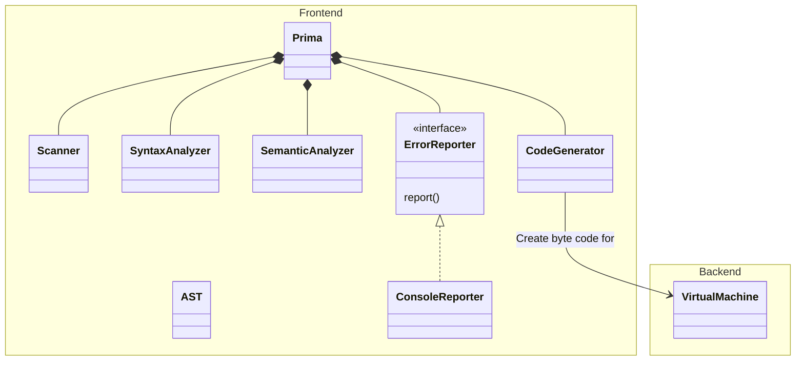
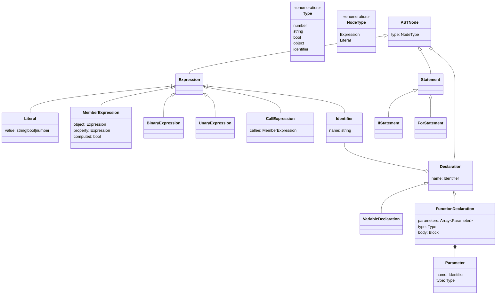

# Prima Language Documentation

## Ссылки
* [Типы](#types)
  * [Ядро](#core)
  * [std](#other)
* [Грамматика](#grammar)
* [Диаграмма классов](#диаграмма-классов)
  * [AST](#ast-types)

## Types

### Core:

* number
* bool
* null
* object
* string

### Other:

* Array
* String (с методами)
* Class (через прототипы)

## Заметки

* Все значения в функции передаются по ссылке

## Grammar:

```
<Program> -> <StatementList> ~#~
<StatementList> -> <Statement>
<StatementList> -> <Statement> <StatementList>
<StatementList> -> ~e~
<Statement> -> <Declaration> ~;~
<Statement> -> <Expression> ~;~
<Statement> -> <IfStatement>
<Statement> -> <ForStatement>
<Statement> -> <ReturnStatement> ~;~
<Statement> -> <Assignment> ~;~
<Declaration> -> <VariableDeclaration>
<Declaration> -> <FunctionDeclaration>
<VariableDeclaration> -> ~var~ ~Identifier~ ~:~ <Type>
<VariableDeclaration> -> ~var~ ~Identifier~ ~:~ <Type> ~=~ <Expression>
<VariableDeclaration> -> ~const~ ~Identifier~ ~:~ <Type> ~=~ <Expression>
<FunctionDeclaration> -> ~function~ ~Identifier~ ~(~ <ParameterList> ~)~ ~:~ <FunctionReturnType> <Block>
<ParameterList> -> <Parameter>
<ParameterList> -> <ParameterList> ~,~ <Parameter>
<ParameterList> -> ~e~
<Parameter> -> ~Identifier~ ~:~ <Type>
<Type> -> ~int~
<Type> -> ~float~
<Type> -> ~bool~
<Type> -> ~null~
<Type> -> ~object~
<Type> -> ~string~
<Type> -> ~array~
<FunctionReturnType> -> <Type>
<FunctionReturnType> -> ~void~

<Expression> -> <LogicalOrExpression>

<LogicalOrExpression> -> <LogicalAndExpression>
<LogicalOrExpression> -> <LogicalOrExpression> ~||~ <LogicalAndExpression>

<LogicalAndExpression> -> <EqualityExpression>
<LogicalAndExpression> -> <LogicalAndExpression> ~&&~ <EqualityExpression>

<EqualityExpression> -> <RelationalExpression>
<EqualityExpression> -> <EqualityExpression> ~==~ <RelationalExpression>
<EqualityExpression> -> <EqualityExpression> ~!=~ <RelationalExpression>

<RelationalExpression> -> <AdditiveExpression>
<RelationalExpression> -> <RelationalExpression> ~<~ <AdditiveExpression>
<RelationalExpression> -> <RelationalExpression> ~<=~ <AdditiveExpression>
<RelationalExpression> -> <RelationalExpression> ~>~ <AdditiveExpression>
<RelationalExpression> -> <RelationalExpression> ~>=~ <AdditiveExpression>

<AdditiveExpression> -> <MultiplicativeExpression>
<AdditiveExpression> -> <AdditiveExpression> ~+~ <MultiplicativeExpression>
<AdditiveExpression> -> <AdditiveExpression> ~-~ <MultiplicativeExpression>

<MultiplicativeExpression> -> <ExponentiationExpression>
<MultiplicativeExpression> -> <MultiplicativeExpression> ~*~ <ExponentiationExpression>
<MultiplicativeExpression> -> <MultiplicativeExpression> ~/~ <ExponentiationExpression>
<MultiplicativeExpression> -> <MultiplicativeExpression> ~%~ <ExponentiationExpression>

<ExponentiationExpression> -> <UnaryExpression>
<ExponentiationExpression> -> <ExponentiationExpression> ~**~ <UnaryExpression>

<UnaryExpression> -> <PostfixExpression>
<UnaryExpression> -> ~-~ <UnaryExpression>
<UnaryExpression> -> ~!~ <UnaryExpression>

<PostfixExpression> -> <PrimaryExpression>
<PostfixExpression> -> <PostfixExpression> ~++~
<PostfixExpression> -> <PostfixExpression> ~--~

<PrimaryExpression> -> ~IntegerLiteral~
<PrimaryExpression> -> ~FloatLiteral~
<PrimaryExpression> -> ~StringLiteral~
<PrimaryExpression> -> ~BooleanLiteral~
<PrimaryExpression> -> ~null~
<PrimaryExpression> -> ~Identifier~
<PrimaryExpression> -> ~(~ <Expression> ~)~
<PrimaryExpression> -> <FunctionCall>

<FunctionCall> -> ~Identifier~ ~(~ <ArgumentList> ~)~

<ArgumentList> -> <Expression>
<ArgumentList> -> <ArgumentList> ~,~ <Expression>
<ArgumentList> -> ~e~

<Block> -> ~{~ <StatementList> ~}~

<IfStatement> -> ~if~ ~(~ <Expression> ~)~ <Block>
<IfStatement> -> ~if~ ~(~ <Expression> ~)~ <Block> ~else~ <Block>
<ForStatement> -> ~for~ ~(~ <FirstForArgument> ~;~ <SecondForArgument> ~;~ <ThirdForArgument> ~)~ <Block>
<FirstForArgument> -> <VariableDeclaration>
<FirstForArgument> -> <Expression>
<FirstForArgument> -> <Assignment>
<FirstForArgument> -> ~e~
<SecondForArgument> -> <Expression>
<SecondForArgument> -> ~e~
<ThirdForArgument> -> <Expression>
<ThirdForArgument> -> ~e~
<ReturnStatement> -> ~return~ <Expression> ~;~
<ReturnStatement> -> ~return~ ~;~

<Assignment> -> ~Identifier~ <AssignmentOperator> <Expression>
<AssignmentOperator> -> ~=~
<AssignmentOperator> -> ~+=~
<AssignmentOperator> -> ~-=~
```

TODO: в грамматике описать объекты, массивы (мб классы).


## Диаграмма классов


[Диаграмма UML](https://drive.google.com/file/d/1UHDILx1tE2_ZwmfK0skRpRAy9a6agTaS/view?usp=sharing)

### AST Types

