# Prima Language Documentation

## Ссылки

* [Типы](#types)
    * [Ядро](#core)
    * [std](#other)
* [Грамматика](#grammar)
* [Диаграмма классов](#диаграмма-классов)
    * [AST](#ast-types)

## Types

### Core:

* number
* bool
* null
* string

### Other:

* Array
* String (с методами)
* Class (через прототипы)

## Заметки

* Все значения в функции передаются по ссылке

## Grammar:

```
<Program> -> <StatementList> ~#~

<StatementList> -> <Statement>
<StatementList> -> <Statement> <StatementList>
<StatementList> -> ~ε~

<Statement> -> <Declaration>
<Statement> -> <Expression> ~;~
<Statement> -> <IfStatement>
<Statement> -> <ForStatement>
<Statement> -> <ReturnStatement> ~;~
<Statement> -> <Assignment> ~;~
<Statement> -> <ContinueStatement> ~;~
<Statement> -> <BreakStatement> ~;~

<ContinueStatement> -> ~continue~
<BreakStatement> -> ~break~

<Block> -> ~{~ <StatementList> ~}~

<Declaration> -> <VariableDeclaration> ~;~
<Declaration> -> <FunctionDeclaration>
<Declaration> -> <ClassDeclaration>
<Declaration> -> <ImportDeclaration>
<Declaration> -> <ExportDeclaration>

<VariableDeclaration> -> ~var~ ~Identifier~ ~:~ <Type>
<VariableDeclaration> -> ~var~ ~Identifier~ ~:~ <Type> ~=~ <Expression>
<VariableDeclaration> -> ~const~ ~Identifier~ ~:~ <Type> ~=~ <Expression>

<ClassDeclaration> -> <AbstractModifier> ~class~ ~Identifier~ <SuperClass> ~{~ <ClassElementList> ~}~
<AbstractModifier> -> ~abstract~
<AbstractModifier> -> ~ε~
<SuperClass> -> ~extends~ ~Identifier~
<SuperClass> -> ~ε~
<ClassElementList> -> <ClassElement>
<ClassElementList> -> <ClassElement> <ClassElementList>
<ClassElementList> -> ~ε~
<ClassElement> -> <PropertyDefinition>
<ClassElement> -> <MethodDefinition>

<PropertyDefinition> -> <AccessibilityModifier> <StaticModifier> <OverrideModifier> ~Identifier~ ~:~ <Type> ~=~ <Expression> ~;~

<MethodDefinition> -> <AccessibilityModifier> <StaticModifier> <OverrideModifier> ~Identifier~ ~(~ <ParameterList> ~)~ ~:~ <FunctionReturnType> <Block>
<MethodDefinition> -> <AccessibilityModifier> <StaticModifier> <OverrideModifier> ~constructor~ ~(~ <ParameterList> ~)~ <Block>

<AccessibilityModifier> -> ~public~
<AccessibilityModifier> -> ~private~
<AccessibilityModifier> -> ~protected~
<AccessibilityModifier> -> ~ε~

<StaticModifier> -> ~static~
<StaticModifier> -> ~ε~

<OverrideModifier> -> ~override~
<OverrideModifier> -> ~ε~

<ImportDeclaration> -> ~import~ ~{~ <ImportSpecifierList> ~}~ ~from~ ~StringLiteral~ ~;~
<ImportSpecifierList> -> <ImportSpecifier>
<ImportSpecifierList> -> <ImportSpecifier> ~,~ <ImportSpecifierList>
<ImportSpecifierList> -> ~ε~
<ImportSpecifier> -> ~Identifier~ ~as~ ~Identifier~
<ImportSpecifier> -> ~Identifier~

<ExportDeclaration> -> ~export~ ~{~ <ExportSpecifierList> ~}~ ~;~
<ExportSpecifierList> -> <ExportSpecifier>
<ExportSpecifierList> -> <ExportSpecifier> ~,~ <ExportSpecifierList>
<ExportSpecifierList> -> ~ε~
<ExportSpecifier> -> ~Identifier~ ~as~ ~Identifier~
<ExportSpecifier> -> ~Identifier~

<FunctionDeclaration> -> ~function~ ~Identifier~ ~(~ <ParameterList> ~)~ ~:~ <FunctionReturnType> <Block>

<ParameterList> -> <Parameter>
<ParameterList> -> <ParameterList> ~,~ <Parameter>
<ParameterList> -> ~ε~
<Parameter> -> ~Identifier~ ~:~ <Type>

<Type> -> ~number~
<Type> -> ~bool~
<Type> -> ~null~
<Type> -> ~string~
<Type> -> ~array~
<Type> -> ~Identifier~

<FunctionReturnType> -> <Type>
<FunctionReturnType> -> ~void~

<Expression> -> <LogicalOrExpression>

<LogicalOrExpression> -> <LogicalAndExpression>
<LogicalOrExpression> -> <LogicalOrExpression> ~||~ <LogicalAndExpression>

<LogicalAndExpression> -> <EqualityExpression>
<LogicalAndExpression> -> <LogicalAndExpression> ~&&~ <EqualityExpression>

<EqualityExpression> -> <RelationalExpression>
<EqualityExpression> -> <EqualityExpression> ~==~ <RelationalExpression>
<EqualityExpression> -> <EqualityExpression> ~!=~ <RelationalExpression>

<RelationalExpression> -> <AdditiveExpression>
<RelationalExpression> -> <RelationalExpression> ~<~ <AdditiveExpression>
<RelationalExpression> -> <RelationalExpression> ~<=~ <AdditiveExpression>
<RelationalExpression> -> <RelationalExpression> ~>~ <AdditiveExpression>
<RelationalExpression> -> <RelationalExpression> ~>=~ <AdditiveExpression>

<AdditiveExpression> -> <MultiplicativeExpression>
<AdditiveExpression> -> <AdditiveExpression> ~+~ <MultiplicativeExpression>
<AdditiveExpression> -> <AdditiveExpression> ~-~ <MultiplicativeExpression>

<MultiplicativeExpression> -> <ExponentiationExpression>
<MultiplicativeExpression> -> <MultiplicativeExpression> ~*~ <ExponentiationExpression>
<MultiplicativeExpression> -> <MultiplicativeExpression> ~/~ <ExponentiationExpression>
<MultiplicativeExpression> -> <MultiplicativeExpression> ~%~ <ExponentiationExpression>

<ExponentiationExpression> -> <UnaryExpression>
<ExponentiationExpression> -> <ExponentiationExpression> ~**~ <UnaryExpression>

<UnaryExpression> -> <PostfixExpression>
<UnaryExpression> -> ~-~ <UnaryExpression>
<UnaryExpression> -> ~!~ <UnaryExpression>

<PostfixExpression> -> <FunctionCall>
<PostfixExpression> -> <FunctionCall> ~++~
<PostfixExpression> -> <FunctionCall> ~--~

<MemberExpression> -> <PrimaryExpression>
<MemberExpression> -> <MemberExpression> ~.~ ~Identifier~
<MemberExpression> -> <MemberExpression> ~[~ <Expression> ~]~

<PrimaryExpression> -> ~NumberLiteral~
<PrimaryExpression> -> ~StringLiteral~
<PrimaryExpression> -> ~BooleanLiteral~
<PrimaryExpression> -> <ArrayLiteral>
<PrimaryExpression> -> ~Identifier~
<PrimaryExpression> -> ~null~
<PrimaryExpression> -> <FunctionExpression>
<PrimaryExpression> -> ~(~ <Expression> ~)~

<FunctionExpression> -> ~function~ ~(~ <ParameterList> ~)~ <Block>

<FunctionCall> -> <MemberExpression> <FunctionCallArgumentList>
<FunctionCallArgumentList> -> ~(~ <ArgumentList> ~)~
<FunctionCallArgumentList> -> ~ε~

<ArrayLiteral> -> ~[~ <ArgumentList> ~]~

<ArgumentList> -> <Expression>
<ArgumentList> -> <ArgumentList> ~,~ <Expression>
<ArgumentList> -> ~ε~

<IfStatement> -> ~if~ ~(~ <Expression> ~)~ <Block>
<IfStatement> -> ~if~ ~(~ <Expression> ~)~ <Block> ~else~ <Block>

<ForStatement> -> ~for~ ~(~ <FirstForArgument> ~;~ <SecondForArgument> ~;~ <ThirdForArgument> ~)~ <Block>
<FirstForArgument> -> <VariableDeclaration>
<FirstForArgument> -> <Expression>
<FirstForArgument> -> <Assignment>
<FirstForArgument> -> ~ε~
<SecondForArgument> -> <Expression>
<SecondForArgument> -> ~ε~
<ThirdForArgument> -> <Expression>
<ThirdForArgument> -> ~ε~

<ReturnStatement> -> ~return~ <Expression>
<ReturnStatement> -> ~return~

<Assignment> -> <MemberExpression> <AssignmentOperator> <Expression>
<AssignmentOperator> -> ~=~
<AssignmentOperator> -> ~+=~
<AssignmentOperator> -> ~-=~
```

TODO: в грамматике описать объекты, массивы

## Диаграмма классов


[Диаграмма UML](https://drive.google.com/file/d/1UHDILx1tE2_ZwmfK0skRpRAy9a6agTaS/view?usp=sharing)

### AST Types

```mermaid
classDiagram
    class Type {
        <<enumeration>>
        number
        string
        bool
        identifier
    }

    class ASTNode {
        nodeType: "string"
    }
    
    class Program {
        body: Array~Statement|Declaration~
    }
    
    class Expression {
        <!-- Тип после вычисления -->
        type: Type
    }
    class Literal {
        type: "string"|"bool"|"number"
        value: string|bool|number
    }
    class MemberExpression {
        object: Expression
        property: Expression
        computed: bool
    }
    class BinaryExpression {
        left: Expression
        right: Expression
        operator: string|Operation
    }
    class UnaryExpression {
        operator: string|Operation
        operand: Expression
    }
    class CallExpression {
        callee: Expression
        arguments: Array~Expression~
    }
    class Identifier {
        name: string
    }
    class FunctionExpression {
        body: BlockStatement
    }

    class Statement
    class ExpressionStatement {
        expression: Expression
    }
    class BlockStatement {
        body: Array~Statement|Declaration~
    }
    class IfStatement {
        condition: Expression
        consequent: BlockStatement
        alternate?: BlockStatement
    }
    class ForStatement {
        init?: Expression
        condition?: Expression
        update?: Expression
        body: BlockStatement
    }

    class Declaration {
        name: Identifier
    }
    class VariableDeclaration {
        kind: "const"|"var"
        type: Type
        initializer?: Expression
    }
    class FunctionDeclaration {
        parameters: Array~Parameter~
        type: Type
        body: BlockStatement
    }
    class Parameter {
        name: Identifier
        type: Type
    }
    class ImportDeclaration {
        source: Literal
        specifiers: Array~ImportSpecifier~
    }
    class ImportSpecifier {
        <!-- imported - импортируемое имя -->
        <!-- local - локальное имя объекта -->
        <!-- Klass as ModuleKlass -->
        <!-- Klass - imported и ModuleKlass - local -->
        <!-- Если нет синонима, то imported == local -->
        imported: Identifier
        local: Identifier
    }
    class ExportDeclaration {
        specifiers: Array~ExportSpecifier~
    }
    class ExportSpecifier {
        exported: Identifier
        local: Identifier 
    }
    class ClassDeclaration {
        superClass?: Expression
        body: Array~PropertyDefinition~
        abstract: bool
    }
    ClassDeclaration *-- PropertyDefinition
    class PropertyDefinition {
        key: Identifier
        value: Expression
        static: bool
        override: bool
        type: Type
        accessibility: "private"|"public"|"protected"
    }
    ClassDeclaration *-- MethodDefinition
    class MethodDefinition {
        constructor: bool
        key: Identifier
        value: FunctionExpression
        static: bool
        override: bool
        accessibility: "private"|"public"|"protected"
    }

    ASTNode <|-- Statement
    Statement <|-- IfStatement
    Statement <|-- ForStatement
    Statement <|-- BlockStatement
    Statement <|-- ExpressionStatement

    ASTNode <|-- Expression
    Expression <|-- Literal
    Expression <|-- MemberExpression
    Expression <|-- BinaryExpression
    Expression <|-- UnaryExpression
    Expression <|-- CallExpression
    Expression <|-- FunctionExpression
    Expression <|-- Identifier
    
    ASTNode <|-- Declaration
    Declaration <|-- VariableDeclaration
    Declaration <|-- ClassDeclaration
    Declaration <|-- FunctionDeclaration
    FunctionDeclaration *-- Parameter
    Declaration <|-- ImportDeclaration
    Declaration <|-- ExportDeclaration
    
    ASTNode <|-- ImportSpecifier
    ASTNode <|-- ExportSpecifier
    
```

