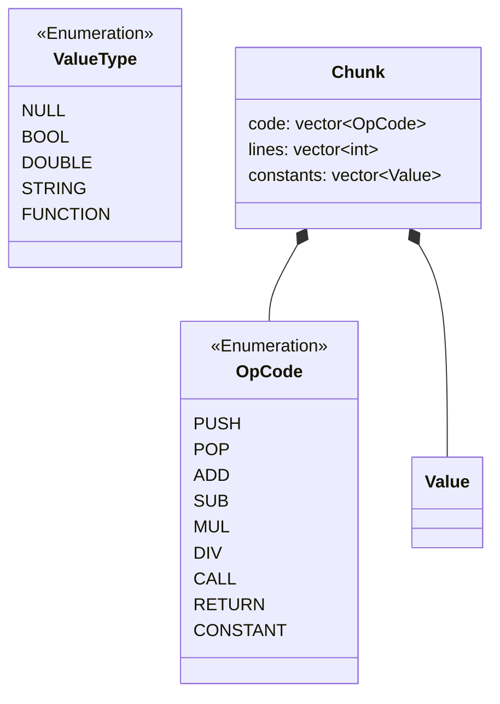

# Виртуальная машина языка Prima

Интерпретатор - Prelude

JIT-компилятор - Prisma

## Список команд
| Код                     | Обозначение | Название  | Стек         | Действие |
|-------------------------|-------------|-----------|--------------|----------|
| c>=0                    | Нет         | Константа | → с          |          |
| -1                      | STOP        | Остановка | Не меняется  |          |
| Арифмитические операции |
| -2                      | ADD         | Сложение  | x, y → x + y |          |

## Архитектура виртуальной машины
